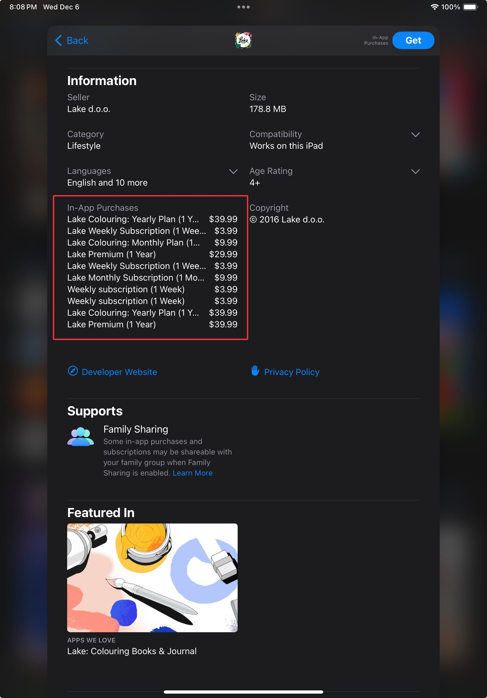

Quick way to color beneath the lines of a coloring page using Procreate.

1. From Procreate's home screen, tap "Photo" and select the coloring page (or tap "Import" if the coloring page is a file).
2. Open the "Layers" menu and change the blend mode of the coloring page to "Linear Burn". You can change the blend mode by tapping the small "N" next to the layer's name.
3. Create a new layer and drag it below coloring page layer.

Done!

 

PSA: Procreate is half the price of a yearly subscription for this coloring book app...

